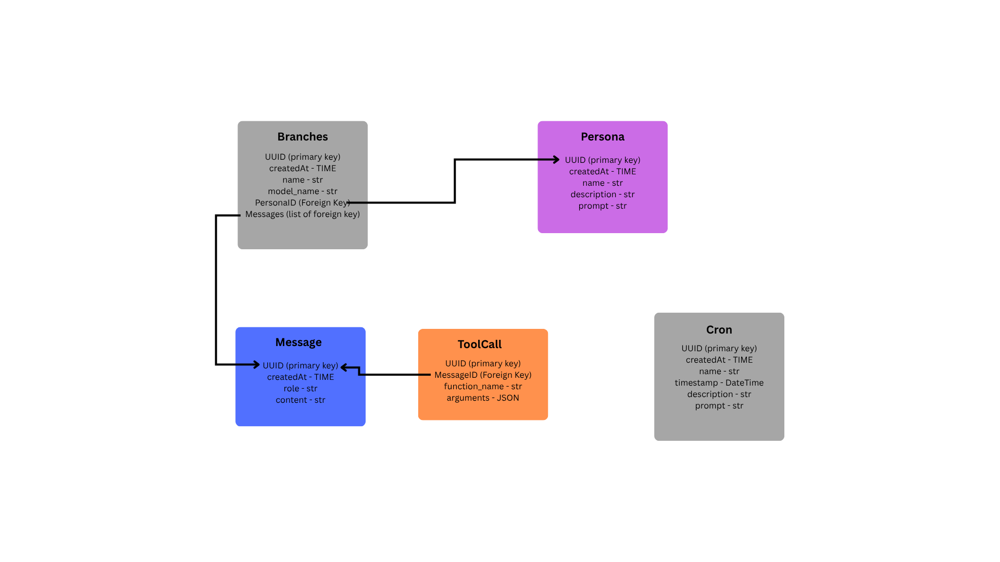

# Persistent database

The persistent database stores conversations so they survive between runs. It is
defined as an abstract interface, `PersistentDatabase`
(`src/sensai/memory/persistent_db/adapter.py`), so the rest of the code does not
depend on a specific backend. A concrete backend (SQLite, Postgres, ...) only has
to implement that interface.

The database holds four kinds of data: **Branch**, **Persona**, **Message** and
**ToolCall**.

## Data model

The diagram is also available as a file: [database.png](database.png).

Every record has a `UUID` primary key and a `createdAt` timestamp.

### Branch

A branch is one conversation thread. Branching lets a conversation be forked at any
point, so different continuations can be explored without losing the original.

| Field        | Type                     | Description                                    |
|--------------|--------------------------|------------------------------------------------|
| `UUID`       | primary key              | Unique id of the branch.                       |
| `createdAt`  | time                     | When the branch was created.                   |
| `name`       | `str`                    | Display name of the branch.                    |
| `model_name` | `str`                    | LLM model used to answer in this branch.       |
| `PersonaID`  | foreign key → Persona    | Persona currently applied to the branch.       |
| `Messages`   | list of foreign keys → Message | Ordered messages of the branch, oldest first. |

A branch references its messages as an ordered list. It points to exactly one
persona, which can be changed later.

Operations:

| Method | Purpose |
|--------|---------|
| `create_branch(current_branch=None)` | Create a new branch and return its `UUID`, or `None` on failure. When `current_branch` is given, the new branch is created from it. |
| `get_branch_list()` | Return all branches as a `dict` of name → `UUID`. |
| `get_branch(current_branch, target_branch)` | Load `target_branch` into the given `Conversation`, replacing its current content. Raises `KeyError` if the id is unknown. |
| `remove_branch(uuid)` | Delete a branch. Raises `KeyError` if the id is unknown. |
| `add_message_to_branch(branch, message)` | Append a `Message` at the end of the branch. |
| `change_branch_persona(branch, persona)` | Switch the persona used by the branch. Returns `True` on success, `False` on failure. |

### Persona

A persona is a reusable behaviour profile for the model: a name, a description, and
the system prompt that is applied when the persona is active. Several branches can
share the same persona.

| Field         | Type        | Description                                         |
|---------------|-------------|-----------------------------------------------------|
| `UUID`        | primary key | Unique id of the persona.                           |
| `createdAt`   | time        | When the persona was created.                       |
| `name`        | `str`       | Display name.                                       |
| `description` | `str`       | Short summary of what the persona is for.           |
| `prompt`      | `str`       | System prompt applied when the persona is active.   |

Operations:

| Method | Purpose |
|--------|---------|
| `create_persona(name, description, timestamp, prompt)` | Store a new persona and return it as a `Persona` object (or `None` on failure). |
| `get_personas()` | Return all personas. |
| `get_persona(persona)` | Return one persona. Raises `KeyError` if the id is unknown. |
| `update_persona(persona, *, name=None, description=None, prompt=None)` | Update only the fields that are passed; fields left as `None` are unchanged. Raises `KeyError` if the id is unknown. |

### Message

A message is one turn of a conversation. It maps directly onto a chat message sent
to the model.

| Field       | Type        | Description                                               |
|-------------|-------------|-----------------------------------------------------------|
| `UUID`      | primary key | Unique id of the message.                                 |
| `createdAt` | time        | When the message was created.                             |
| `role`      | `str`       | Author of the message: `system`, `user`, `assistant` or `tool`. |
| `content`   | `str`       | Text of the message.                                      |

Messages do not point back to their branch. The branch owns the list, which gives
the order. Use `get_messages(branch)` to read all the messages of a branch, oldest
first, and `add_message_to_branch(branch, message)` to add one.

## Usage notes

- `get_branch` and `remove_branch` raise `KeyError` for an unknown id, while
  `create_branch`, `change_branch_persona` and `create_persona` report failure by
  returning `None` or `False`.
- Code should depend on `PersistentDatabase`, not on a concrete backend. Create the
  backend once (in `main.py`) and pass it to the components that need it.
